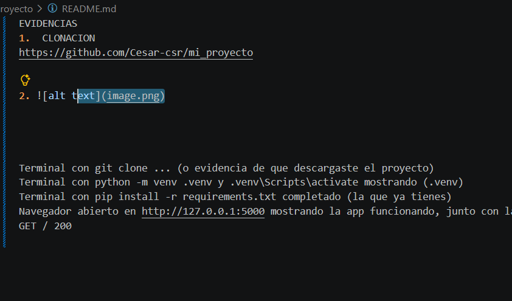
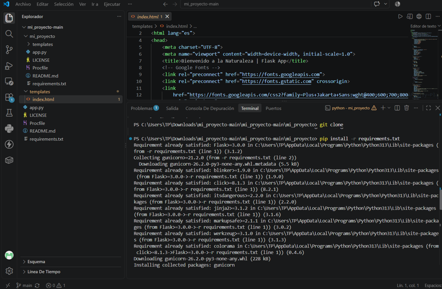
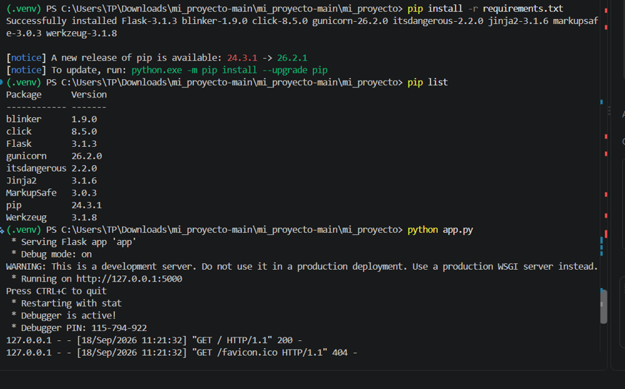

EVIDENCIAS 
1.	CLONACION
https://github.com/Cesar-csr/mi_proyecto 
https://mi-proyecto-cesar-ocampo-raigosa.onrender.com

 

2. 
    
    

    Terminal con git clone ... (o evidencia de que descargaste el proyecto) 
Terminal con python -m venv .venv y .venv\Scripts\activate mostrando (.venv) 
Terminal con pip install -r requirements.txt completado (la que ya tienes) 
Navegador abierto en http://127.0.0.1:5000 mostrando la app funcionando, junto con la terminal mostrando el GET / 200

 

 

